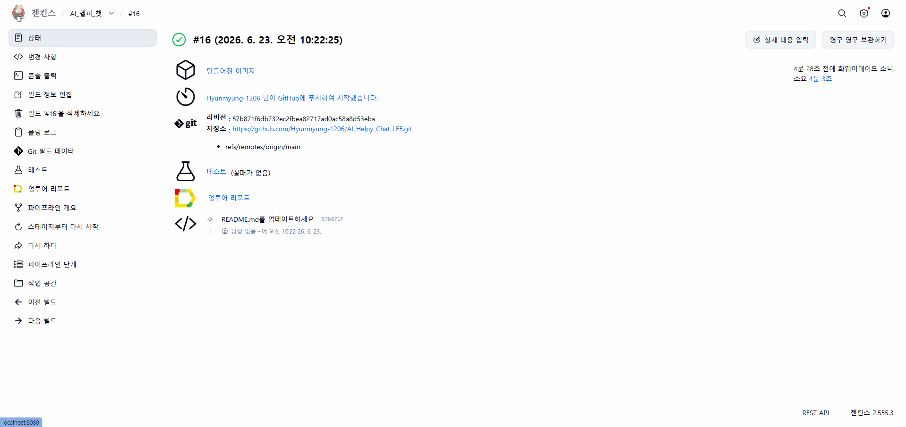
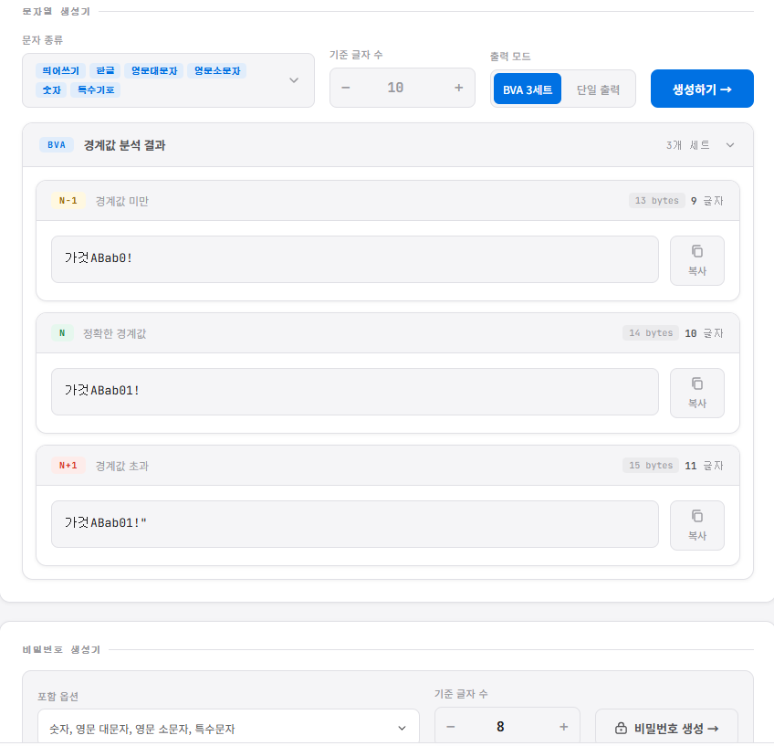

# AI Helpy Chat QA Automation

> AI Helpy Chat은 5인 팀 프로젝트이며, 본 문서는 제가 담당한 QA 자동화와 테스트 산출물을 중심으로 정리했습니다.<br> 
> Jenkins와 Docker를 활용한 자동화 CI/CD 파이프라인을 구성하고, Allure Report로 테스트 결과를 시각화했습니다.<br>
>프로젝트 **원본 저장소**는 👉 [**AI_Helpy_Chat**](https://github.com/Hyunmyung-1206/AI_Helpy_chat.git) 을 참고해 주세요.


---

## 핵심 성과

| 구분 | 성과 |
|---|---|
| TC 설계 | 전체 198건 중 94건 담당 |
| 시나리오 설계 | 전체 43개 중 28개 담당 |
| 결함 관리 | 버그 리포트 3건 작성 및 추적 |
| 트러블슈팅 | 자동화 구축 중 발생 이슈 21건 기록 |
| 자동화 테스트 | Quiz/PPT/Deep 상세 테스트 30건 구성 |
| 회귀 관리 | known issue 4건을 `pytest.mark.xfail`로 추적 |
| CI/CD | Docker Compose + Jenkins + Allure Report 연동 |

---

## 핵심 기능

| 기능 | 구현 내용 |
|---|---|
| Jenkins CI | GitHub push 기반 Pipeline 실행, JUnit/Allure 결과 수집 |
| Docker 테스트 환경 | `tests` 컨테이너와 `selenium/standalone-chrome` 컨테이너 분리 |
| 병렬 테스트 | `pytest-xdist` 3 workers로 상세 테스트 30건 실행 |
| 리포트 | Jenkins 테스트 결과와 Allure Report로 실행 결과 시각화 |
| 결함 추적 | known issue 4건을 `xfail`로 유지해 회귀 테스트에서 추적 |

### Jenkins Pipeline



### Docker Compose Test Run


---

## 자동화 구조

```text
GitHub push
  -> Jenkins Pipeline
  -> Docker golden image / test image build
  -> selenium/standalone-chrome container
  -> tests container에서 pytest-xdist 실행
  -> JUnit XML + Allure Report publish
```

### Docker 테스트 파이프라인

```text
1. Jenkins가 GitHub push를 감지해 Pipeline 시작
2. docker compose build tests로 테스트 실행 이미지 빌드
3. selenium/standalone-chrome 컨테이너 실행 및 healthcheck 통과 대기
4. tests 컨테이너에서 pytest 상세 테스트 30건 실행
5. pytest-xdist 3 workers로 병렬 실행
6. reports/junit.xml, allure-results/, logs/ 산출물 생성
7. Jenkins post 단계에서 JUnit/Allure publish 및 artifact 보관
8. docker compose down --remove-orphans로 컨테이너 정리
```

### 실행 방법

Docker Compose:

```bash
docker compose up --build --abort-on-container-exit --exit-code-from tests tests
```

Local pytest:

```bash
pytest tests/test_quiz_create.py tests/test_ppt_create.py tests/test_deep_create.py -n 3 --browser chrome
```

---

## 상세 문서

| 문서 | 내용 |
|---|---|
| [담당 테스트 케이스 94건](qa-artifacts/test-cases.md) | TC ID, 기능 depth, 진행 절차, 기대 결과, 결과, 중요도, 자동화 여부 |
| [담당 테스트 시나리오 28개](qa-artifacts/test-scenarios.md) | PPT, Quiz, Deep Investigation 시나리오 흐름과 연관 TC |
| [버그 리포트 3건](qa-artifacts/bug-reports.md) | 테스트 중 발견한 결함과 `xfail` 기반 회귀 추적 현황 |
| [트러블슈팅 보고서](output/pdf/AI_Helpy_Chat_Troubleshooting_Report_2026-06-22.pdf) | Jenkins, Docker, Allure, GitHub 연동 및 테스트 안정화 이슈 해결 과정 |

---

## 회고

프로젝트를 진행하면서 Codex AI를 적극적으로 활용해 기존 코드 흐름을 파악하고, 테스트 파일 분리, 공통 base 모듈 정리, Docker/Jenkins 기반 실행 환경 구성 방향을 잡았습니다. Codex를 단순 코드 작성 도구로만 사용하지 않고, 테스트 구조를 점검하고 반복되는 작업을 줄이는 협업 도구로 활용한 점이 이번 프로젝트의 중요한 경험이었습니다.

특히 경계값 테스트를 수동으로 진행하면서 글자 수 확인과 입력값 생성에 시간이 많이 소요되는 문제가 있었습니다. 이를 개선하기 위해 별도의 경계값 검증 도구를 제작했고, 주제/지시사항 입력값 검증 시 반복 작업을 줄여 테스트 수행 효율을 높였습니다.



- 실행 링크: [QA Boundary Value Tool](https://hyunmyung-1206.github.io/qa-boundary-value-tool/)
- 상세 저장소: [Hyunmyung-1206/qa-boundary-value-tool](https://github.com/Hyunmyung-1206/qa-boundary-value-tool.git)
